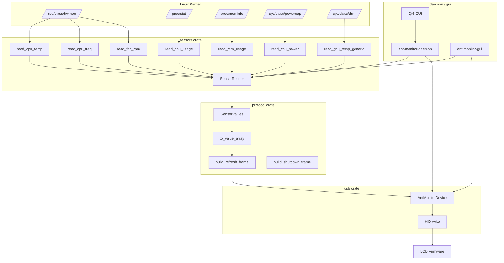
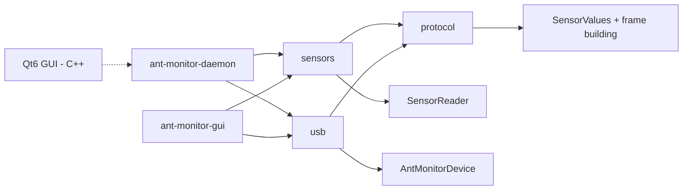

<div align="center">

# 🧊 ANT Esports IceStorm AIO — Linux Driver

**Native Linux driver for ANT Esports IceStorm AIO LCD coolers.**

No Windows. No WINE. No proprietary software.

[](LICENSE)
[](https://www.rust-lang.org)
[](https://kernel.org)


[]()

</div>

---

## 📋 Table of Contents

- [Overview](#-overview)
- [Supported Hardware](#-supported-hardware)
- [Features](#-features)
- [Screenshots](#-screenshots)
- [Architecture](#-architecture)
- [Directory Structure](#-directory-structure)
- [Installation](#-installation)
- [Quick Start](#-quick-start)
- [Usage](#-usage)
  - [Daemon (systemd)](#daemon-systemd)
  - [CLI Monitor](#cli-monitor)
  - [Qt6 Desktop GUI](#qt6-desktop-gui)
- [How It Works](#-how-it-works)
  - [Sensor Reading](#sensor-reading)
  - [Frame Encoding](#frame-encoding)
  - [USB Communication](#usb-communication)
- [Protocol](#-protocol)
- [Reverse Engineering Notes](#-reverse-engineering-notes)
- [Configuration](#-configuration)
- [Development](#-development)
- [Troubleshooting](#-troubleshooting)
- [Roadmap](#-roadmap)
- [FAQ](#-faq)
- [Contributing](#-contributing)
- [Acknowledgements](#-acknowledgements)
- [License](#-license)

---

## 📖 Overview

The **ANT Esports IceStorm AIO** (and compatible Vevor / HT LCD coolers) includes a
built-in LCD display that shows real-time PC sensor data — CPU temperature, GPU
temperature, fan speed, clock frequencies, power consumption, and more.

Unfortunately, the manufacturer only provides a **Windows-only** utility
(`ANTESPORTS-Monitor.exe`) with no official Linux support.

This project is a **complete, native Linux replacement** that:

- ✅ Reads sensor data from standard Linux kernel interfaces (`hwmon`, `procfs`)
- ✅ Encodes it into the exact HID frame format the LCD firmware expects
- ✅ Communicates via USB HID without any proprietary drivers
- ✅ Runs as a headless systemd daemon with automatic device hotplug
- ✅ Provides a terminal-based CLI monitor and a Qt6 desktop GUI
- ✅ Supports two protocol families: **Classic** (ANT Esports / Vevor / HT) and **iUnity** (Antec)

### Why this exists

The original Windows .NET application (`PC Monitoring.exe`) was reverse-engineered
from its compiled binaries. The USB HID protocol was documented and reimplemented
in Rust — no decompiled code, no binary blobs, no emulation layer. Every byte
sent to the LCD has been verified against the original application's behavior.

---

## 🖥️ Supported Hardware

| Device | Vendor ID | Product ID | Protocol | Status |
|--------|-----------|------------|----------|--------|
| **ANT Esports IceStorm AIO LCD** | `0x5131` | `0x2007` | Classic | ✅ Working |
| **Vevor LCD Cooler** | `0x5131` | `0x2007` | Classic | ✅ Working |
| **HT / PC Monitor All V3** | `0x5131` | `0x2007` | Classic | ✅ Working |
| **Antec Vortex View** | `0x2022` | `0x0522` | iUnity | ✅ Working |
| **Antec Flux Pro** | `0x2022` | `0x0522` | iUnity | ✅ Working |

> **Note:** The Classic protocol uses a straightforward 65-byte HID output report.
> The iUnity protocol uses a compact 12-byte packet with checksum. Both are
> handled transparently by the daemon.

---

## ✨ Features

### ✅ Implemented

| Feature | Description |
|---------|-------------|
| **CPU Temperature** | Reads from `coretemp` / `k10temp` / `zenpower` hwmon driver |
| **CPU Usage** | Delta-based calculation from `/proc/stat` |
| **CPU Power** | Intel RAPL energy counter via `/sys/class/powercap` |
| **CPU Frequency** | Current scaling frequency from cpufreq |
| **CPU Voltage** | Auto-detected from Super I/O or CPU hwmon |
| **GPU Temperature** | Generic drm/hwmon discovery (AMD, NVIDIA, Intel) |
| **Fan RPM** | First available fan sensor from any hwmon device |
| **RAM Usage** | Calculated from `/proc/meminfo` (MemTotal - MemAvailable) |
| **Date / Time** | Sent to LCD for on-screen clock display |
| **Classic HID Protocol** | 65-byte output report with 33 value bytes |
| **iUnity HID Protocol** | 12-byte packet with checksum validation |
| **Non-blocking USB** | Writes never block; handles device busy gracefully |
| **Auto-reconnect** | Retries connection on device disconnect |
| **Startup Burst** | Sends 5 initial frames rapidly on connect |
| **Systemd Service** | Automatic start on boot, restart on crash |
| **udev Rules** | No root required for HID access |
| **CLI Monitor** | Real-time terminal-based sensor readout |
| **Qt6 GUI** | Desktop application with dark mode |
| **Fahrenheit Support** | Configurable temperature unit |

### 🚧 In Progress

| Feature | Notes |
|---------|-------|
| Device init sequence | `sendInfoStu()` equivalent from Windows app — bytes unknown |
| GPU usage/power/freq | Requires NVML for NVIDIA or `gpu_busy_percent` for AMD |
| Pump RPM auto-detection | Requires user-configurable hwmon path |

### 📝 Planned

| Feature | Priority |
|---------|----------|
| Configurable update interval | Low |
| Multiple display profiles | Low |
| LCD brightness control | Low |
| Custom display images | Low |
| AUR package | Low |
| Snap / Flatpak | Low |

---

## 📸 Screenshots

<div align="center">

### Qt6 Desktop GUI

```
┌─────────────────────────────────────┐
│        ANT ESPORTS Monitor          │
│                                     │
│  ┌── CPU ────────────────────────┐  │
│  │  53°C                         │  │
│  │  ████████████░░░░░░░░░ 42%    │  │
│  │  Usage: 42% │ Freq: 2400 MHz  │  │
│  │  Power: 75 W │ Volt: 1.2 V    │  │
│  └───────────────────────────────┘  │
│                                     │
│  ┌── GPU ────────────────────────┐  │
│  │  45°C                         │  │
│  │  ██████████████░░░░░░░ 68%    │  │
│  │  Usage: 68% │ Freq: 1800 MHz  │  │
│  │  Power: 150 W                  │  │
│  └───────────────────────────────┘  │
│                                     │
│  Fan: 1234 RPM │ RAM: 67%          │
│  Device: 0x5131:0x2007 (Classic)   │
└─────────────────────────────────────┘
```

### CLI Monitor

```
ANTESPORTS Monitor CLI
======================
Device Connected: 0x5131:0x2007 (Classic)
CPU:  53.0°C  42%  2400MHz | GPU:  45.0°C  68% | Fan: 1234 RPM | RAM: 67%
```

### LCD Display

The LCD on the cooler shows real-time sensor data with its own firmware rendering.
The host only streams the numeric values — the LCD handles all graphics.

</div>

---

## 🏗️ Architecture

The project is organized as a **Rust workspace** with five interdependent crates.

### Data Flow



### Crate Dependency Graph



### Timing

```mermaid
sequenceDiagram
    participant Daemon
    participant Sensors
    participant Protocol
    participant USB
    participant LCD

    loop Every 200ms
        Daemon->>Sensors: read_all()
        Sensors->>Linux: /sys, /proc
        Linux-->>Sensors: raw values
        Sensors-->>Daemon: SensorValues
        Daemon->>Protocol: to_value_array()
        Protocol-->>Daemon: [u8; 33]
        Daemon->>Protocol: build_refresh_frame()
        Protocol-->>Daemon: Vec<u8> (65 bytes)
        Daemon->>USB: device.write(frame)
        USB-->>Daemon: Ok(())
        Daemon->>Daemon: sleep(200ms)
    end
```

---

## 📁 Directory Structure

```
ant-esports-icestorm-aio-linux-drivers/
├── protocol/                    # 📦 HID protocol crate
│   ├── Cargo.toml               #     serde, chrono, serde_json
│   └── src/
│       ├── lib.rs               #     Re-exports frame module
│       └── frame.rs             #     SensorValues, b(), frame builders, tests
│
├── sensors/                     # 📦 Sensor reading crate
│   ├── Cargo.toml               #     ant-monitor-protocol, log, thiserror
│   └── src/
│       ├── lib.rs               #     Re-exports reader module
│       └── reader.rs            #     SensorReader, hwmon/procfs reads
│
├── usb/                         # 📦 USB HID crate
│   ├── Cargo.toml               #     hidapi, ant-monitor-protocol
│   └── src/
│       ├── lib.rs               #     Re-exports device module
│       └── device.rs            #     AntMonitorDevice, open/write/shutdown
│
├── ant-monitor-daemon/          # 🖥️ Headless systemd service
│   ├── Cargo.toml               #     log, simple-logging, signal-hook
│   └── src/
│       └── main.rs              #     run_loop, signal handling, reconnect
│
├── ant-monitor-gui/             # 🖥️ CLI terminal monitor
│   ├── Cargo.toml               #     All three library crates
│   └── src/
│       └── main.rs              #     Threaded sensor reader + live display
│
├── gui/                         # 🎨 Optional Qt6 desktop GUI
│   ├── CMakeLists.txt           #     Qt6 Widgets build
│   ├── main.cpp                 #     Application entry point, dark palette
│   ├── mainwindow.cpp           #     UI widgets, timer, sensor parsing
│   └── mainwindow.h             #     Window class declaration
│
├── scripts/                     # ⚙️ Installation scripts
│   ├── install.sh               #     Full system installer
│   └── 99-ant-monitor.rules     #     udev rules for HID access
│
├── systemd/                     # 🔧 System service files
│   ├── ant-monitor-daemon.service  #  systemd unit
│   └── ant-monitor-gui.desktop     #  Desktop entry
│
├── docs/
│   └── PROTOCOL.md              # 📖 Full USB HID protocol spec
│
├── Cargo.toml                   # Workspace definition (resolver = "2")
├── LICENSE                      # MIT License
├── .gitignore                   # /target, *.rs.bk, Cargo.lock
└── build.sh                     # Convenience build script
```

---

## 🚀 Installation

### Prerequisites

| Package | Purpose | Required |
|---------|---------|----------|
| Rust toolchain | Build the project | ✅ Yes |
| `libudev-dev` | USB device enumeration | ✅ Yes |
| `libhidapi-dev` | HID communication | ✅ Yes |
| `qt6-base-dev` | Qt6 Desktop GUI | ❌ Optional |
| `cmake` | Qt6 build system | ❌ Optional |
| `g++` | C++ compiler | ❌ Optional |

### Dependencies

```bash
# Debian / Ubuntu / Linux Mint
sudo apt install libudev-dev libhidapi-dev

# Fedora
sudo dnf install systemd-devel hidapi-devel

# Arch Linux
sudo pacman -S udev hidapi

# openSUSE
sudo zypper install systemd-devel hidapi-devel

# NixOS
nix-shell -p udev hidapi
```

### Install Rust

```bash
curl --proto '=https' --tlsv1.2 -sSf https://sh.rustup.rs | sh
```

### Build from Source

```bash
git clone https://github.com/YOUR_USER/ant-esports-icestorm-aio-linux-drivers.git
cd ant-esports-icestorm-aio-linux-drivers

cargo build --release
```

### Full System Install

```bash
sudo ./scripts/install.sh
```

This will:
1. Build the project in release mode
2. Install `ant-monitor-daemon` and `ant-monitor-gui` to `/usr/bin/`
3. Install udev rules to `/etc/udev/rules.d/`
4. Install and start the systemd service

> **⚠️ Important:** After installing udev rules, **unplug and replug** the USB
> cooler for the new permissions to take effect.

### Manual Install

```bash
# Build
cargo build --release

# Install binaries
sudo install -m 755 target/release/ant-monitor-daemon /usr/bin/
sudo install -m 755 target/release/ant-monitor-gui /usr/bin/

# Install udev rules (no root needed for HID access)
sudo install -m 644 scripts/99-ant-monitor.rules /etc/udev/rules.d/
sudo udevadm control --reload-rules && sudo udevadm trigger

# Install and start systemd service
sudo install -m 644 systemd/ant-monitor-daemon.service /etc/systemd/system/
sudo systemctl daemon-reload
sudo systemctl enable --now ant-monitor-daemon

# (Optional) Build Qt6 GUI
cd gui
cmake -B build -DCMAKE_BUILD_TYPE=Release
cmake --build build
sudo install -m 755 build/ant-monitor-gui /usr/bin/
```

### Qt6 Desktop GUI (Optional)

```bash
sudo apt install qt6-base-dev cmake g++   # Debian/Ubuntu
cd gui
cmake -B build -DCMAKE_BUILD_TYPE=Release
cmake --build build
./build/ant-monitor-gui
```

---

## ⚡ Quick Start

```bash
# 1. Clone and build
git clone https://github.com/YOUR_USER/ant-esports-icestorm-aio-linux-drivers.git
cd ant-esports-icestorm-aio-linux-drivers
cargo build --release

# 2. Run the daemon (single run, no install)
./target/release/ant-monitor-daemon

# 3. Open another terminal and watch the CLI monitor
./target/release/ant-monitor-gui
```

---

## 🎮 Usage

### Daemon (systemd)

```bash
# Check status
systemctl status ant-monitor-daemon

# View live logs
journalctl -u ant-monitor-daemon -f

# Restart
sudo systemctl restart ant-monitor-daemon

# Stop
sudo systemctl stop ant-monitor-daemon

# Disable auto-start
sudo systemctl disable ant-monitor-daemon
```

### CLI Monitor

```bash
# Run standalone (auto-detects device)
ant-monitor-gui
```

Output:
```
ANTESPORTS Monitor CLI
======================
Device Connected: 0x5131:0x2007 (Classic)
CPU:  53.0°C  42%  2400MHz | GPU:  45.0°C  68% | Fan: 1234 RPM | RAM: 67%
```

The CLI monitor updates in real-time (200ms interval) and shows:
- CPU temperature, usage percentage, frequency
- GPU temperature, usage percentage, frequency
- Fan speed
- RAM usage

### Qt6 Desktop GUI

```bash
# If built from gui/ directory
./gui/build/ant-monitor-gui
```

The Qt6 GUI provides:
- **Dark mode** by default (Fusion style with custom palette)
- Large temperature displays for CPU and GPU
- Progress bars for CPU and GPU usage
- Detailed sensor info (power, frequency, voltage)
- Fan and RAM status
- Device connection status
- Automatic refresh every second

---

## 🔧 How It Works

### Sensor Reading

The `SensorReader` in the `sensors` crate reads from standard Linux kernel interfaces:

| Sensor | Source | Path | Method |
|--------|--------|------|--------|
| **CPU Temperature** | hwmon | `/sys/class/hwmon/*/temp*_input` | Millidegrees → °C (÷1000) |
| **CPU Usage** | procfs | `/proc/stat` | Delta of (total - idle) / total |
| **CPU Power** | powercap (RAPL) | `/sys/class/powercap/*/energy_uj` | Energy delta ÷ time |
| **CPU Frequency** | cpufreq | `/sys/devices/system/cpu/cpu0/cpufreq/scaling_cur_freq` | kHz → MHz (÷1000) |
| **CPU Voltage** | hwmon | `/sys/class/hwmon/*/in*_input` | Raw millivolts → volts |
| **GPU Temperature** | DRM/hwmon | `/sys/class/drm/card*/device/hwmon/*/temp1_input` | Millidegrees → °C |
| **Fan RPM** | hwmon | `/sys/class/hwmon/*/fan*_input` | Raw RPM value |
| **RAM Usage** | procfs | `/proc/meminfo` | (Total - Available) / Total |

### Frame Encoding

The `SensorValues` struct is encoded into a **33-byte value array** using:
- **Truncation** (not rounding) — matching the C# `(byte)` cast in the original Windows app
- Each value is decimal-split into integer and fractional parts
- Clamped to 0–255 per byte

The 33 bytes encode:
```
[0]   CPU temp integer      [11]  GPU temp fraction
[1]   CPU temp fraction     [12]  GPU temp unit
[2]   CPU temp unit         [13]  GPU usage
[3]   CPU usage             [14]  GPU power low
[4]   CPU power low         [15]  GPU power fraction
[5]   CPU power fraction    [16]  GPU freq / 100
[6]   CPU freq / 100        [17]  GPU freq % 100
[7]   CPU freq % 100        [18]  Fan RPM / 100
[8]   CPU voltage int       [19]  Fan RPM % 100
[9]   CPU voltage frac*     [20]  Pump RPM / 100
[10]  GPU temp integer      [21]  Pump RPM % 100
                            [22..29]  Date/time
                            [30]  RAM usage
                            [31]  CPU power / 100
                            [32]  GPU power / 100
```

> **🔍 Voltage quirk:** The original .NET app stores `trunc(voltage) × 100`
> (integer part only, no fractional digits). This copy-paste bug is reproduced
> for firmware compatibility.

### USB Communication

1. The `AntMonitorDevice` opens the HID device via `hidapi`
2. Non-blocking mode prevents write hangs
3. A 65-byte frame is written: `[reportID=0x00, header=0x00, 33 value bytes, padding]`
4. Writes happen every **200ms** (configurable)
5. On startup, **5 frames are sent rapidly** to initialize the LCD
6. On shutdown, a special frame with `0x0F` in the header byte clears the display
7. If the device disconnects, the daemon retries every 2 seconds

---

## 📜 Protocol

The full USB HID protocol specification is documented in
[`docs/PROTOCOL.md`](docs/PROTOCOL.md).

### Protocol Overview

| Property | Value |
|----------|-------|
| Transport | USB HID (hidraw) |
| Direction | Host → Device (output report) |
| Frame size | 65 bytes (1 report ID + 64 data) |
| Refresh rate | 200ms |
| Value bytes | 33 per frame |
| Encoding | Truncation (C# `(byte)` cast) |

### Key Findings

- **Byte layout:** Values start at `byte[2]`, not `byte[4]` as some references claim
- **Truncation:** Values are truncated, not rounded — `b(x) = clamp(trunc(x), 0, 255)`
- **Voltage encoding:** Confirmed quirk — `v[9] = trunc(voltage) × 100`
- **Power split:** Power values > 100W are split across two bytes (low + high)
- **Shutdown:** Header byte `0x0F` (never used in normal data frames)

---

## 🔬 Reverse Engineering Notes

### How the Protocol Was Discovered

The USB HID protocol was reverse-engineered from the official Windows application
(`ANTESPORTS-Monitor.exe` / `PC Monitoring.exe`), a .NET WinForms application
using the CyUSB HID API:

1. The installer was decompressed (Inno Setup, zlib streams)
2. The main .NET assembly was analyzed for HID-related classes
3. Key classes identified: `MainHidInterFace`, `hidApi_Write`, `sendInfoStu`
4. String references confirmed: VID `0x5131`, PID `0x2007`, report structure
5. An open-source [Python reference implementation](https://github.com/coldwelderx/cooler-lcd-linux)
   had already decoded the 33-byte value array layout
6. Hardware testing revealed the correct byte alignment (values at byte[2], not byte[4])

### What Is Still Unknown

- **Device init sequence:** The Windows app's `sendInfoStu()` function sends
  an initialization structure to the device. The exact bytes are unknown without
  further decompilation of the .NET SDK library (`WitmodHardwareInfoLibrary.dll`).
- **GPU power/usage/freq on AMD:** AMD GPUs expose these via `gpu_busy_percent`
  and power sensors in hwmon, but the paths vary by driver version.
- **Firmware commands:** There may be additional opcodes for brightness, orientation,
  or display mode switching (strings like `TempShowModel` and `AppUiShow` were
  found in the binary but the command bytes are unknown).

### What Was Corrected

| Original Belief | Corrected Fact |
|----------------|----------------|
| Values start at `byte[4]` (after 3 header bytes) | Values start at `byte[2]` (1 header byte) |
| `0x01` = opcode, `0x02` = subopcode | These bytes are artifacts of CyUSB abstraction |
| Rounding for byte conversion | Truncation (C# casts truncate toward zero) |
| Voltage stores fractional part | Voltage stores `trunc(V) × 100` (no fraction) |

---

## ⚙️ Configuration

All configuration constants are defined in the source code:

| Constant | File | Default | Description |
|----------|------|---------|-------------|
| `REFRESH_INTERVAL` | `ant-monitor-daemon/src/main.rs` | 200ms | Time between LCD updates |
| `STARTUP_BURST_COUNT` | `ant-monitor-daemon/src/main.rs` | 5 | Frames sent on connect |
| `RECONNECT_DELAY` | `ant-monitor-daemon/src/main.rs` | 2s | Wait before reconnect attempt |
| `DEVICE_TIMEOUT` | `ant-monitor-daemon/src/main.rs` | 10s | Max time to wait for device |
| `TEMP_UNIT_CELSIUS` | `protocol/src/frame.rs` | `0` | Unit flag for Celsius |
| `TEMP_UNIT_FAHRENHEIT` | `protocol/src/frame.rs` | `1` | Unit flag for Fahrenheit |

To customize, edit the values in the source files and rebuild:

```bash
# Change refresh rate to 500ms
# Edit REFRESH_INTERVAL in ant-monitor-daemon/src/main.rs
# Then rebuild
cargo build --release
sudo systemctl restart ant-monitor-daemon
```

---

## 👨‍💻 Development

### Project Layout

The project is a **Cargo workspace** with 5 crates:

```
protocol  ←──  sensors
    ↓
   usb     ←──  ant-monitor-daemon
                    ant-monitor-gui
```

- `protocol` — No external dependencies beyond `serde` and `chrono`. Pure data encoding.
- `sensors` — Depends on `protocol`. Linux-specific (hwmon, procfs).
- `usb` — Depends on `protocol`. Uses `hidapi` for HID communication.
- `ant-monitor-daemon` — Depends on all three. Signal handling, main loop.
- `ant-monitor-gui` — Depends on all three. Multi-threaded terminal UI.

### Building

```bash
# Build everything
cargo build

# Build release
cargo build --release

# Build a specific crate
cargo build -p ant-monitor-daemon

# Run tests
cargo test
```

### Testing

```bash
# Run all tests
cargo test

# Run protocol tests only
cargo test -p ant-monitor-protocol
```

Unit tests cover:
- `b()` truncation behavior
- `to_value_array` encoding with known values
- Frame structure (length, header bytes, padding)
- Shutdown frame format
- iUnity frame encoding (known values, zero, clamping)
- Rounding regression (ensuring truncation is not accidentally changed to rounding)

### Debugging

```bash
# Run daemon with info logging (default)
./target/release/ant-monitor-daemon

# The daemon logs:
#   INFO  - Startup, device connection, shutdown
#   DEBUG - Per-frame sensor values (requires log level change)
#   WARN  - Device disconnection, write errors
#   ERROR - Unexpected USB errors
```

To enable debug logging, change `log::LevelFilter::Info` to
`log::LevelFilter::Debug` in `ant-monitor-daemon/src/main.rs` and rebuild.

### Adding a New Sensor

1. Add the field to `SensorValues` in `protocol/src/frame.rs`
2. Add a reading method to `SensorReader` in `sensors/src/reader.rs`
3. Add the value to `read_all()` and `to_value_array()`
4. Update the value array index in the encoding
5. Update `PROTOCOL.md` with the new byte index

### Coding Conventions

- **No comments in production code** — let the code speak
- **Truncation, not rounding** — always use `trunc()` for byte conversions
- **No AI-generated protocol bytes** — every byte must be verified against evidence
- **Fallible values default to 0.0** — missing sensors return 0, not errors

---

## 🔍 Troubleshooting

<details>
<summary><b>❌ Device not detected</b></summary>

```bash
# Check USB device
lsusb | grep -E "5131:2007|2022:0522"

# Check HID devices
ls /dev/hidraw*

# Check kernel messages
dmesg | grep -i hid

# Run daemon in foreground (no systemd)
./target/release/ant-monitor-daemon
```

If the device shows up in `lsusb` but the daemon can't open it:
```
sudo udevadm control --reload-rules && sudo udevadm trigger
```
Then unplug and replug the USB cable.
</details>

<details>
<summary><b>🔴 Permission denied (no /dev/hidraw access)</b></summary>

```bash
# Check current permissions
ls -la /dev/hidraw*

# Ensure udev rules are installed
ls /etc/udev/rules.d/99-ant-monitor.rules

# Reload and trigger
sudo udevadm control --reload-rules
sudo udevadm trigger

# Alternatively, run with sudo
sudo ./target/release/ant-monitor-daemon
```
</details>

<details>
<summary><b>🌡️ LCD shows wrong temperature</b></summary>

This is usually caused by:
1. **Old daemon still running** — `pkill ant-monitor-daemon` then restart
2. **Incorrect frame format** — ensure you're using the latest build
3. **Multiple instances** — check with `ps aux | grep ant-monitor`

If the LCD shows **1°C**, it means the value bytes are shifted (an old protocol
interpretation had 3 header bytes, but the correct format has only 1).
Rebuild with the latest code.
</details>

<details>
<summary><b>🔄 Daemon is slow to stop/restart</b></summary>

```bash
# Force kill if systemd stop hangs
sudo systemctl kill ant-monitor-daemon
sudo systemctl restart ant-monitor-daemon
```

The old blocking-mode writes could hang indefinitely. The current code uses
non-blocking writes and has a 10-second device timeout. If upgrading from an
older version, kill the old process first.
</details>

<details>
<summary><b>📊 No GPU temperature shown</b></summary>

The GPU temperature reader scans `/sys/class/drm/card*/device/hwmon/*/temp1_input`.
If your GPU driver doesn't expose a hwmon temperature interface:

- **NVIDIA:** Load the `nvidia` kernel module (proprietary driver)
- **AMD:** The `amdgpu` driver exposes temperature via hwmon by default
- **Intel:** Integrated GPUs use `i915` hwmon

```bash
# Check available GPU sensors
find /sys/class/drm -name "temp*_input" 2>/dev/null
```
</details>

<details>
<summary><b>⚡ No CPU power reading</b></summary>

CPU power requires Intel RAPL or AMD Zen power counters:

```bash
# Check available RAPL domains
ls /sys/class/powercap/*/name 2>/dev/null

# Should show "package-0" or "psys"
cat /sys/class/powercap/intel-rapl:0/name
```

If RAPL is not available, CPU power will report 0.0W.
</details>

---

## 🗺️ Roadmap

### Near Future
- [ ] Extract and decompile the .NET `WitmodHardwareInfoLibrary.dll` for init sequence
- [ ] Add AMD GPU usage via `gpu_busy_percent`
- [ ] Add AMD GPU power via hwmon `power1_average`
- [ ] Add NVIDIA GPU support via NVML (optional)

### Future
- [ ] Configurable refresh interval
- [ ] Configurable sensor sources
- [ ] Multiple display profiles for different usage scenarios
- [ ] Pump RPM configuration UI
- [ ] LCD brightness control
- [ ] AUR package for Arch Linux

### Long Term
- [ ] Image/framebuffer upload support (if the LCD supports custom images)
- [ ] Web-based configuration interface
- [ ] Flatpak / Snap packages
- [ ] Cross-platform support (macOS, BSD)

---

## ❓ FAQ

<details>
<summary><b>Does this work without the ANT Esports cooler?</b></summary>
No. This software only works with ANT Esports IceStorm AIO LCD coolers
and compatible devices (Vevor, HT, Antec iUnity).
</details>

<details>
<summary><b>Does the LCD show custom images/framebuffer?</b></summary>
No. The host only streams numeric sensor values. The LCD firmware handles
all rendering internally. There is no framebuffer upload protocol.
</details>

<details>
<summary><b>Can I use this with WINE?</b></summary>
You can try, but this is a native Linux driver — no WINE is needed.
Running under WINE would be counterproductive.
</details>

<details>
<summary><b>Do I need to compile from source?</b></summary>
Currently yes. Pre-built binaries and distribution packages are planned
for future releases.
</details>

<details>
<summary><b>Will this work on a Raspberry Pi?</b></summary>
The software should compile and run on any Linux system with USB HID support.
However, sensor readings depend on kernel interfaces (hwmon, RAPL, cpufreq)
that may not be available on all platforms.
</details>

<details>
<summary><b>Does this support multiple coolers simultaneously?</b></summary>
Not yet. The daemon connects to the first device it finds. Multi-device
support is a potential future enhancement.
</details>

---

## 🤝 Contributing

Contributions are welcome and encouraged!

### How to Contribute

1. **Fork** the repository
2. **Create a feature branch**: `git checkout -b feat/my-feature`
3. **Make your changes**
4. **Run tests**: `cargo test && cargo clippy`
5. **Commit**: Use conventional commits format (`feat:`, `fix:`, `docs:`, etc.)
6. **Push**: `git push origin feat/my-feature`
7. **Open a Pull Request**

### Guidelines

- **No comments in code** — prefer expressive variable names and well-factored logic
- **No invented protocol bytes** — every byte must have evidence or be marked UNKNOWN
- **Truncation, not rounding** — match the C# `(byte)` cast behavior
- **Run clippy** before submitting: `cargo clippy --all-targets`
- **Write tests** for new encoding paths
- **Update PROTOCOL.md** for any protocol changes

---

## 🙏 Acknowledgements

### Libraries & Tools

- [hidapi-rs](https://github.com/ruabmbua/hidapi-rs) — Rust bindings for the HID API
- [hidapi](https://github.com/libusb/hidapi) — C library for HID communication
- [serde](https://serde.rs) — Serialization framework
- [chrono](https://github.com/chronotope/chrono) — Date and time library
- [thiserror](https://github.com/dtolnay/thiserror) — Error derive macro
- [signal-hook](https://github.com/vorner/signal-hook) — Signal handlers for Rust
- [simple-logging](https://crates.io/crates/simple-logging) — Lightweight logger

### Reference Projects

- **[coldwelderx/cooler-lcd-linux](https://github.com/coldwelderx/cooler-lcd-linux)** —
  Original Python reference implementation that decoded the 33-byte value array layout
- **[MoiSieurAlex/HID_LCD_Test](https://github.com/MoiSieurAlex/HID_LCD_Test)** —
  Research for the iUnity protocol (0x2022:0x0522)

These projects were invaluable in understanding the USB HID protocol without
having to fully reverse-engineer the Windows binary from scratch.

---

## 📄 License

This project is licensed under the **MIT License** — see the [LICENSE](LICENSE) file
for details.

```
MIT License

Copyright (c) 2026

Permission is hereby granted, free of charge, to any person obtaining a copy
of this software and associated documentation files (the "Software"), to deal
in the Software without restriction, including without limitation the rights
to use, copy, modify, merge, publish, distribute, sublicense, and/or sell
copies of the Software, and to permit persons to whom the Software is
furnished to do so, subject to the following conditions:

The above copyright notice and this permission notice shall be included in all
copies or substantial portions of the Software.
```

---

<div align="center">

**Made with ❤️ for the Linux community**

[Report Bug](https://github.com/YOUR_USER/ant-esports-icestorm-aio-linux-drivers/issues) ·
[Request Feature](https://github.com/YOUR_USER/ant-esports-icestorm-aio-linux-drivers/issues) ·
[Discussions](https://github.com/YOUR_USER/ant-esports-icestorm-aio-linux-drivers/discussions)

</div>
